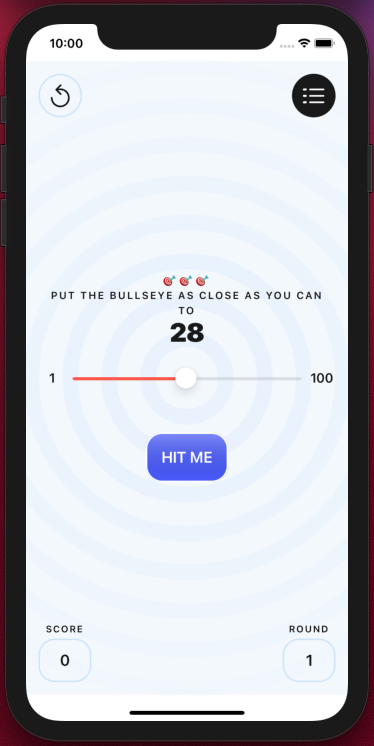
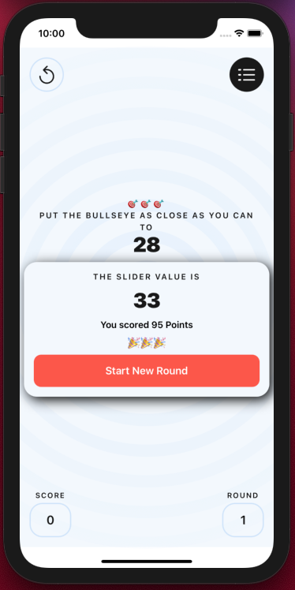
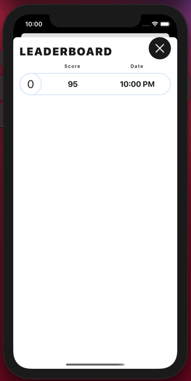

# Bullseye
Tutorial used to produce iOS app written in SwiftUI. Generated random number, then use slider to try and match the given number by position of the slider.
This was a good challenge after learning some UIKit first. Nice to add more design elements to buttons and background.

## To Run App - 

1. Hit the green 'Code' button on this repo and copy the link to clone project
2. Load up xcode.
3. Under Source Control, click 'Clone'
4. Paste link into window and click 'Clone'
5. Navigate to where project is to be saved
6. Once opened, Run project and calculate!

### UI Design

                
